# NixFiles Entity Relationship Diagram

Generated from:

- `NixFiles/Data/AppDbContext.cs`
- `NixFiles/Migrations/20260517223331_InitialCreate.cs`
- `NixFiles/Migrations/AppDbContextModelSnapshot.cs`
- Entity classes under `NixFiles/Models`

## ER Diagram

```mermaid
erDiagram
    ASPNETUSERS {
        string Id PK
        string UserName
        string NormalizedUserName "unique, nullable"
        string Email
        string NormalizedEmail
        bool EmailConfirmed
        string PasswordHash
        string SecurityStamp
        string ConcurrencyStamp
        string PhoneNumber
        bool PhoneNumberConfirmed
        bool TwoFactorEnabled
        datetimeoffset LockoutEnd
        bool LockoutEnabled
        int AccessFailedCount
    }

    ASPNETROLES {
        string Id PK
        string Name
        string NormalizedName "unique, nullable"
        string ConcurrencyStamp
    }

    ASPNETROLECLAIMS {
        int Id PK
        string RoleId FK
        string ClaimType
        string ClaimValue
    }

    ASPNETUSERCLAIMS {
        int Id PK
        string UserId FK
        string ClaimType
        string ClaimValue
    }

    ASPNETUSERLOGINS {
        string LoginProvider PK
        string ProviderKey PK
        string ProviderDisplayName
        string UserId FK
    }

    ASPNETUSERROLES {
        string UserId PK,FK
        string RoleId PK,FK
    }

    ASPNETUSERTOKENS {
        string UserId PK,FK
        string LoginProvider PK
        string Name PK
        string Value
    }

    NOTES {
        string Name PK "nvarchar(450)"
        string Content "required"
        string PasswordHash
        datetime CreatedAt "default SYSUTCDATETIME()"
        datetime UpdatedAt "default SYSUTCDATETIME()"
        datetime ExpiresAt
    }

    BOOKMARKS {
        int Id PK
        string UserId FK "nvarchar(450)"
        string NoteName FK "nvarchar(450)"
        datetime CreatedAt "default SYSUTCDATETIME()"
    }

    NOTEVERSIONS {
        int Id PK
        string NoteName FK "nvarchar(450)"
        string Content "required"
        datetime CreatedAt "default SYSUTCDATETIME()"
    }

    NOTEACCESSLOGS {
        int Id PK
        string NoteName FK "nvarchar(450)"
        datetime AccessedAt "default SYSUTCDATETIME()"
        string IpAddress "nvarchar(45)"
        string UserAgent
    }

    TAGS {
        int Id PK
        string Name "unique, nvarchar(100)"
    }

    NOTETAGS {
        string NoteName PK,FK "nvarchar(450)"
        int TagId PK,FK
    }

    ASPNETROLES ||--o{ ASPNETROLECLAIMS : has
    ASPNETUSERS ||--o{ ASPNETUSERCLAIMS : has
    ASPNETUSERS ||--o{ ASPNETUSERLOGINS : has
    ASPNETUSERS ||--o{ ASPNETUSERTOKENS : has
    ASPNETUSERS ||--o{ ASPNETUSERROLES : assigned
    ASPNETROLES ||--o{ ASPNETUSERROLES : assigned

    ASPNETUSERS ||--o{ BOOKMARKS : creates
    NOTES ||--o{ BOOKMARKS : bookmarked_as
    NOTES ||--o{ NOTEVERSIONS : has
    NOTES ||--o{ NOTEACCESSLOGS : logs
    NOTES ||--o{ NOTETAGS : categorized_by
    TAGS ||--o{ NOTETAGS : categorizes
```

## Relationship Summary

| Relationship | Cardinality | Foreign key | Delete behavior |
| --- | --- | --- | --- |
| `AspNetRoles` to `AspNetRoleClaims` | One role to many role claims | `AspNetRoleClaims.RoleId -> AspNetRoles.Id` | Cascade |
| `AspNetUsers` to `AspNetUserClaims` | One user to many claims | `AspNetUserClaims.UserId -> AspNetUsers.Id` | Cascade |
| `AspNetUsers` to `AspNetUserLogins` | One user to many external logins | `AspNetUserLogins.UserId -> AspNetUsers.Id` | Cascade |
| `AspNetUsers` to `AspNetUserTokens` | One user to many tokens | `AspNetUserTokens.UserId -> AspNetUsers.Id` | Cascade |
| `AspNetUsers` to `AspNetRoles` | Many-to-many through `AspNetUserRoles` | `AspNetUserRoles.UserId -> AspNetUsers.Id`, `AspNetUserRoles.RoleId -> AspNetRoles.Id` | Cascade |
| `AspNetUsers` to `Bookmarks` | One user to many bookmarks | `Bookmarks.UserId -> AspNetUsers.Id` | Cascade |
| `Notes` to `Bookmarks` | One note to many bookmarks | `Bookmarks.NoteName -> Notes.Name` | Cascade |
| `Notes` to `NoteVersions` | One note to many saved versions | `NoteVersions.NoteName -> Notes.Name` | Cascade |
| `Notes` to `NoteAccessLogs` | One note to many access logs | `NoteAccessLogs.NoteName -> Notes.Name` | Cascade |
| `Notes` to `Tags` | Many-to-many through `NoteTags` | `NoteTags.NoteName -> Notes.Name`, `NoteTags.TagId -> Tags.Id` | Cascade |

## Keys And Indexes

| Table | Primary key | Additional indexes / constraints |
| --- | --- | --- |
| `AspNetRoles` | `Id` | Unique filtered index on `NormalizedName` named `RoleNameIndex` |
| `AspNetRoleClaims` | `Id` | Index on `RoleId` |
| `AspNetUsers` | `Id` | Index on `NormalizedEmail` named `EmailIndex`; unique filtered index on `NormalizedUserName` named `UserNameIndex` |
| `AspNetUserClaims` | `Id` | Index on `UserId` |
| `AspNetUserLogins` | `LoginProvider`, `ProviderKey` | Index on `UserId` |
| `AspNetUserRoles` | `UserId`, `RoleId` | Index on `RoleId` |
| `AspNetUserTokens` | `UserId`, `LoginProvider`, `Name` | None beyond primary key |
| `Notes` | `Name` | `Name` max length 450 |
| `Bookmarks` | `Id` | Unique index on `UserId`, `NoteName`; index on `NoteName` |
| `NoteVersions` | `Id` | Index on `NoteName` |
| `NoteAccessLogs` | `Id` | Index on `NoteName`; `IpAddress` max length 45 |
| `Tags` | `Id` | Unique index on `Name`; `Name` max length 100 |
| `NoteTags` | `NoteName`, `TagId` | Index on `TagId` |

## Notes

- `Note.Name` is the principal key for note-related tables instead of a numeric note ID.
- `Bookmarks` acts as a user-to-note join table with payload column `CreatedAt`; the unique `UserId, NoteName` index prevents duplicate bookmarks for the same user and note.
- `NoteTags` is the explicit join table for the `Notes` and `Tags` many-to-many relationship.
- ASP.NET Identity tables are included because they are created by the migration and are part of the active `AppDbContext` model.
